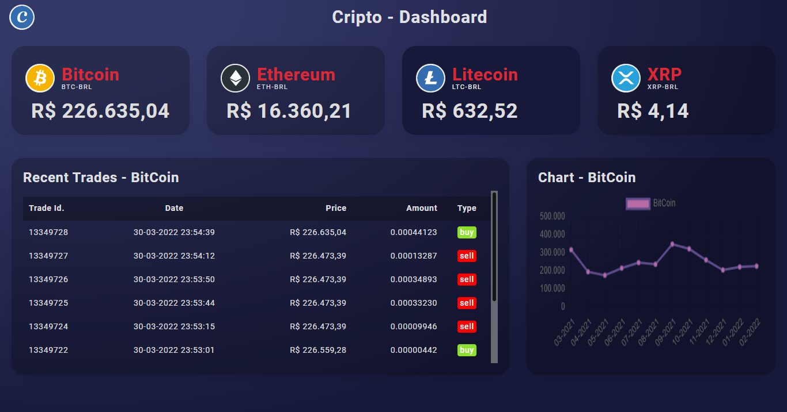

# Cripto - Dashboard

## Description

> This project aims to create a crypto dashboard, which consumes the MercadoBitcoin API and displays the last quotes, the last executed orders and a chart with the variation of the last quotes;

---

## Requirements
- Node.js v8+

---
## Technologies Used:
- Node;
- Express;
- Axios;
- EJS;
- TypeScript;
- Charts;

---

## Running on Local Machine

- **Install dependencies:**
  > yarn
- **Run project in development:**
  > yarn dev
- **Run project in prod:**
  1. **Build project:**
      > yarn build
  2. **Run project:**
      > yarn start

---

## Running on Docker

- **Requirements:**
  - Docker and Docker Compose;
- **Run:**
    > docker-compose up

---

## Dashboard Url

> http://localhost:3000/

 

---

## Endpoints

- **List Coin Data:**
  - Description:
    > List coin information;
  - Endpoint:
    > http://localhost:3000/coins/:coin
    >   ex:  
    > http://localhost:3000/coins/BTC-BRL
- **List Last Trades:**
  - Description:
    > List last 10 trades of the coin;
  - Endpoint:
    > http://localhost:3000/coins/:coin/trades
    >   ex:  
    > http://localhost:3000/coins/BTC-BRL/trades
- **List Candles:**
  - Description:
    > List last 12 months candles of the coin
  - Endpoint:
    > http://localhost:3000/coins/:coin/candles
    >   ex:  
    > http://localhost:3000/coins/BTC-BRL/candles

---

## Pendencies:

  - [x] Sort table in descending order;
  - [x] Implement chart with latest quotes;
  - [x] Change Logo;
  - [x] Implement docker;
  - [ ] Change chart color;
